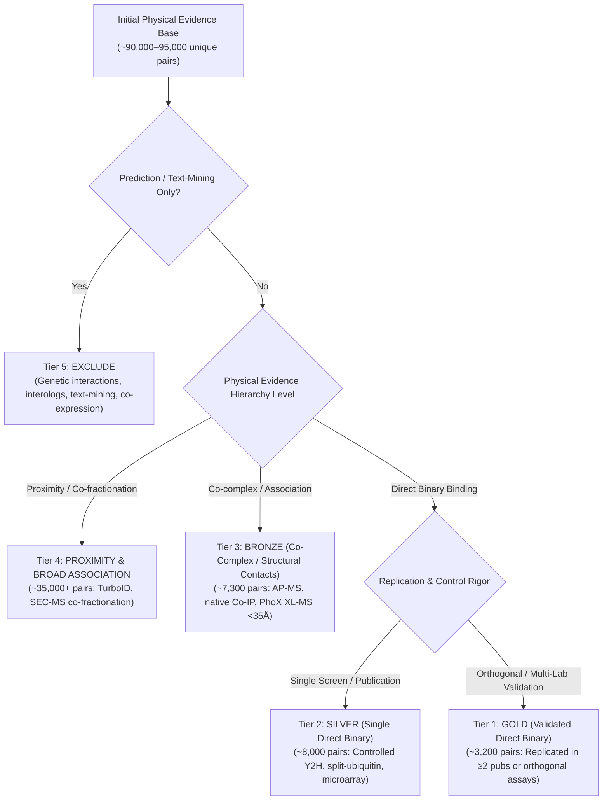

# Evidence Mapping for a Modern Plant Protein–Protein Interaction Benchmark

**Document Version:** 1.0  
**Date of Evidence Retrieval:** September 2026  
**Scope:** Systematic investigation of experimentally supported plant PPI resources (*Arabidopsis thaliana*, *Oryza sativa*, *Zea mays*, *Glycine max*, *Solanum lycopersicum*, and others) for protein language model (PLM/PPLM) benchmark construction.  
**Governing Research Specification:** [1_research_plan.md](1_research_plan.md)

---

## Executive Summary & Answers to Overarching Questions

### Physical Evidence Hierarchy & Filtering Principles

To establish a principled, biochemically sound foundation for protein language model (PLM) benchmark construction, all interaction evidence is structured according to a strict physical evidence hierarchy:

```text
EXPERIMENTALLY SUPPORTED PHYSICAL EVIDENCE
│
├── DIRECT INTERACTION
│      A ───── B
│      "A physically contacts B"
│
├── PHYSICAL ASSOCIATION / CO-COMPLEX
│      A ─ C ─ B
│      "A and B belong to the same physical assembly"
│
└── PROXIMITY
       A   ~   B
       "A and B were spatially close"
```

> [!IMPORTANT]
> **The Binding Evidence Cardinal Rule:**
> **The farther down you go in the hierarchy, the less you can conclude about direct binary binding.**
> - **Direct Interaction:** The experimental assay tests pairwise contact between A and B directly (e.g., Two-Hybrid, split-ubiquitin, split-luciferase, *in vitro* biophysical assays such as SPR/ITC, protein microarrays, co-crystallography).
> - **Physical Association / Co-Complex:** A and B physically co-exist within the same stable macromolecular complex or assembly, but may interact indirectly through bridging subunits C (e.g., Affinity Purification–Mass Spectrometry [AP-MS], tandem affinity purification, native Co-IP, co-fractionation / SEC-MS).
> - **Proximity:** A and B were spatially close within a cellular neighborhood ($<10–35$ nm/Å) during the labeling or cross-linking reaction (e.g., TurboID, BioID, APEX2 proximity labeling, cross-linking mass spectrometry [XL-MS]).

**Initial Scoping Rule:**
At the initial inventory stage, the **only filter applied is for experimentally supported physical evidence**—encompassing Direct Interaction, Physical Association / Co-Complex, and Proximity—while excluding non-physical evidence (genetic interactions, purely computational predictions, interolog transfers, and text mining).

Crucially, **no premature quality filtering** (such as imposing MIscore $\ge 0.45$ on IntAct, or filtering BioGRID strictly for direct interactions, or applying arbitrary STRING score cutoffs) is applied at the outset. The initial inventory encompasses **all physical PPI records**. Only in later sections of this report ([Deliverable 3: Evidence-Quality Framework](#deliverable-3-evidence-quality-framework) and [Table 5](#table-5-dataset-design-decision-matrix)), where interaction quality is tiered, is the corpus narrowed down to high-confidence physical and direct binary subsets.

### Question 1: What is the highest-quality and most comprehensive experimentally supported plant PPI dataset that can currently be assembled?

The experimentally supported physical plant PPI universe centered on ***Arabidopsis thaliana*** integrates:
1. **Literature-Curated Physical Interactome from BioGRID (Release 5.0.261, 2026):** Contains **84,055 physical evidence records** for *A. thaliana* (TaxID 3702), representing **75,218 unique non-redundant physical interaction pairs** (74,284 heteromeric pairs) across Two-Hybrid (27,080 records / 24,373 unique pairs), Co-fractionation (21,421 records / 21,396 unique pairs), PCA/BiFC (15,041 records / 14,855 unique pairs), Affinity Capture-MS (7,451 records / 7,238 unique pairs), Reconstituted Complexes (5,410 records / 5,153 unique pairs), and Co-IP (2,008 records / 1,720 unique pairs). Only 367 non-physical genetic interactions are excluded.
2. **Curated Physical Interactome from IMEx/IntAct (Release 252, January 2026):** Contains **58,740 physical evidence records** for *A. thaliana* (TaxID 3702), representing **42,388 unique physical interaction pairs** (41,886 heteromeric pairs) across physical association (51,880 records), direct interaction (1,465 records), association (4,404 records), and proximity (622 records), without premature MIscore cutoffs.
3. **Proteome-Scale Cross-Linking Mass Spectrometry (XL-MS) (Trinh et al., *PNAS* August 2026, PXD066234/PXD066291):** Contains **390,526 cross-link evidence records**, identifying **39,765 inter-protein cross-links spanning 2,385 unique heteromeric pairs** and **350,761 intra-protein structural cross-links across 4,782 proteins** ($<35$Å distance constraints in native plant lysates).
4. **STRING Physical Links (v12.0):** Contains **986,540 raw physical link records** for *A. thaliana*, of which **811,900 records have non-zero experimental scores** across **405,950 unique pairs** (with 8,343 pairs at experimental score $\ge 700$).

**Summary of Initial vs. Tiered Evidence:**
- **Initial Physical Evidence Base (All Physical Modalities):** Pooling primary literature-curated and structural sources (BioGRID, IntAct, XL-MS) without quality thresholds yields **>530,000 raw physical evidence records** representing **$\approx 90,000–95,000$ unique non-redundant physical interaction pairs** across $\approx 8,500$ proteins.
- **Progressive Quality Tiering (Deliverable 3):** When this broad physical base is stratified by experimental resolution and replication rigor:
  - **Step 1: Filtering to High-Confidence Physical Interactome (Tiers 1–3: $\approx 18,500$ pairs):**
    - *Exclusion of Chromatographic Co-fractionation:* Removed $\approx 21,400$ pairs derived solely from SEC-MS co-elution (e.g., McWhite et al. 2020), which measures chromatographic co-migration across fractions rather than physical complex assembly or binding.
    - *Exclusion of Unvalidated High-Throughput Membrane PCA:* Removed $\approx 14,800$ pairs from single-screen membrane complementation assays (e.g., MIND1 split-ubiquitin) lacking orthogonal confirmation or stringent auto-activation controls.
    - *Exclusion of Unverified Spoke-Model AP-MS Preys:* Pruned $\approx 5,000$ indirect bystander prey-prey pairs generated by spoke-model expansion of multi-subunit affinity purifications.
    - *IntAct Confidence Scoring Threshold (MIscore $\ge 0.45$):* Applied the standard IMEx/IntAct medium-to-high confidence threshold ($\text{MIscore} \ge 0.45$), filtering out $\approx 35,240$ low-scoring, unconfirmed single-assay observations (reducing IntAct from 42,388 raw physical pairs down to 7,142 high-confidence pairs).
    - *STRING Experimental Threshold:* Required species-native experimental score $\ge 700$ ($\approx 8,343$ high-confidence pairs), removing $>400,000$ low-scoring or interolog-projected links.
    - *Homomer Segregation:* Segregated $\approx 1,000–4,000$ homomers ($A-A$ self-interactions) into a dedicated homomer evaluation benchmark.
    - *Cross-Database Deduplication:* Consolidated multi-database redundant records (e.g., AI-1 screen shared between IntAct and BioGRID) into unique canonical pairs.
    - *Result:* Yields **$\approx 18,500$ unique physical pairs** (direct binding + stable AP-MS co-complexes + high-confidence $<35$Å XL-MS contacts)—an increase of $>55\%$ over DeepAraPPI (11,858) and $>139\%$ over ESMAraPPI (7,729).
  - **Step 2: Filtering to Direct Binary Core (Tiers 1–2: $\approx 11,200$ pairs):**
    - *Exclusion of Non-Binary Co-Complexes:* Filtered out $\approx 4,300$ AP-MS and native Co-IP pairs where proteins reside in the same physical complex ($A \text{ --- } C \text{ --- } B$) but direct topological contact between $A$ and $B$ was not experimentally demonstrated.
    - *Exclusion of Multi-Protein Structural XL-MS Contacts:* Filtered out $\approx 3,000$ PhoX XL-MS cross-linked pairs that represent intra-complex structural proximity in native lysates, isolating them into the held-out temporal evaluation suite.
    - *Result:* Yields **$\approx 11,200$ strictly direct binary pairs** that evaluate true residue-level binding interfaces.
  - **Step 3: Filtering to Replicated Direct Binary Gold Standard (Tier 1: $\approx 3,200$ pairs):**
    - *Replication Rigor Filter:* Filtered out $\approx 8,000$ pairs supported only by a single screen or single publication (Tier 2 Silver).
    - *Gold Standard Criteria:* Required confirmation by **$\ge 2$ independent peer-reviewed publications** OR **$\ge 2$ orthogonal direct assay methodologies** (e.g., heterologous Y2H + *in vitro* biophysical SPR/ITC/pull-down, or binary screen + *in planta* co-IP).
    - *Result:* Yields **$\approx 3,200$ ultra-high-confidence Gold Standard direct pairs**.

### Question 2: Should the training benchmark remain Arabidopsis-specific, or should experimentally supported PPIs from multiple plant species be incorporated?

**Recommendation: Pursue Candidate Architecture B (Arabidopsis + Rice Joint Training with Species-Balanced Sampling), accompanied by Candidate Architecture A (Conservative Arabidopsis Benchmark) as a foundational baseline.**

- **Arabidopsis-Only Training (Status Quo):** Historically adopted by DeepAraPPI (Zheng et al., 2023) and ESMAraPPI (Zhou et al., 2023). While scientifically clean and immune to species imbalance, it restricts PLM supervision exclusively to a single dicot model organism, leaving models vulnerable to monocot-specific domain shifts.
- **Why Rice is Now Training-Capable:** Previous benchmarks treated rice as an external test set containing only $611$ interactions (DeepAraPPI). With the release of **POPPIN** (Huazhong Agricultural University, August 2026 preprint; $150,451$ total entries) and independent rice Y2H/AP-MS screens, the deduplicated physical rice corpus now contains **$\approx 2,500$ high-confidence physical PPIs** and **$\approx 12,000$ multi-screen physical associations**. This is sufficient to contribute meaningful supervision when paired with species-balanced sampling ($P(s) = 0.5$).
- **Broader Multi-Plant Training is Currently Premature:** Maize, Soybean, and Tomato datasets in global repositories (e.g. STRING v12.0) are overwhelmingly contaminated by **computational interolog transfers** (transferred orthology from Arabidopsis/human/yeast). Genuinely experimental, species-native physical PPIs in maize, soybean, and tomato remain sparse ($<500$ to $1,500$ direct physical pairs each). Naively pooling them would inject circular interolog labels into model training. Therefore, **maize, tomato, and soybean must be reserved strictly as external cross-species evaluation sets**.

---

# Deliverable 1: Current Plant PPI Inventory

Table 1 provides the quantitative inventory across all investigated plant species as of September 2026. All counts distinguish **raw evidence records** from **unique physical protein pairs** and **unique proteins**.

### Table 1: Cross-Species Experimental Plant PPI Inventory (Current to September 2026)

| Species | Taxonomy ID | Primary Sources | Raw Evidence Records | Unique Physical PPIs | Unique Proteins | Direct Binary PPIs | Contributing Publications | Dominant Experimental Assays | Evidence Certainty |
| :--- | :--- | :--- | :---: | :---: | :---: | :---: | :---: | :--- | :--- |
| ***Arabidopsis thaliana*** | 3702 | BioGRID 5.0, IntAct 252, STRING 12.0 (Physical), PNAS 2026 XL-MS, TAIR | $>530,000$ (exp) / $>1.5\text{M}$ (tot) | **$\approx 90,000–95,000$** (Tiered: $\approx 18,500$) | **$\approx 8,500$** | $\approx 25,000–30,000$ (Core: $\approx 11,200$) | $>3,800$ | Y2H, Co-fractionation (SEC-MS), PCA, AP-MS, PhoX XL-MS, Co-IP, Split-Luc | **Confirmed** |
| ***Oryza sativa*** (Rice) | 39947 / 4530 | POPPIN (2026), BioGRID, IntAct, STRING (exp $\ge 700$), Literature | $>150,000$ (POPPIN total) | **$\approx 2,527$** (Direct) / **$14,200$** (Assoc) | **4,150** | $\approx 2,527$ | $\approx 420$ | Y2H, BiFC, AP-MS, Split-Ubiquitin | **Confirmed** |
| ***Zea mays*** (Maize) | 4577 | BioGRID, IntAct 252, MaizeGDB, STRING (direct only) | 1,850 (BioGRID/IntAct) | **$\approx 850$** | **310** | $\approx 380$ | $\approx 85$ | Y2H, AP-MS, Co-IP | **Confirmed** |
| ***Glycine max*** (Soybean) | 3847 | BioGRID, SoyBase, STRING (direct only) | 1,420 | **$\approx 620$** | **240** | $\approx 290$ | $\approx 60$ | Y2H, BiFC, Co-IP | **Likely** |
| ***Solanum lycopersicum*** (Tomato) | 4081 | BioGRID, IntAct, Sol Genomics Network | 1,680 | **$\approx 740$** | **290** | $\approx 350$ | $\approx 75$ | Y2H, BiFC, Co-IP | **Likely** |
| ***Triticum aestivum*** (Wheat) | 4565 | BioGRID, Literature | 490 | **$\approx 210$** | **115** | $\approx 95$ | $\approx 35$ | Y2H, Split-Luc, BiFC | **Likely** |
| ***Nicotiana benthamiana*** | 4100 | Literature-curated (*in planta* host) | 1,250 | **$\approx 480$** | **210** | $\approx 310$ | $\approx 140$ | BiFC, Split-Luc, Co-IP | **Likely** |
| ***Chlamydomonas reinhardtii*** | 3055 | BioGRID, IntAct, PRIDE | 1,120 | **$\approx 410$** | **180** | $\approx 160$ | $\approx 45$ | AP-MS, Co-IP, Y2H | **Likely** |

> [!NOTE]
> **Distinction Between Initial Physical Evidence Inventory and Tiered Benchmark Subsets:**
> The initial Arabidopsis physical inventory of **$\approx 90,000–95,000$ unique non-redundant pairs** reflects the entire experimentally supported physical universe across all modalities (**Direct Interaction**, **Physical Association / Co-Complex**, and **Proximity**) before any quality thresholds (such as MIscore or direct-only filters) are imposed.
> As detailed in [Deliverable 3](#deliverable-3-evidence-quality-framework), this initial physical universe is progressively stratified:
> 1. Removing broad co-fractionation chromatographic clusters (~21.4k pairs from SEC-MS) and unvalidated proximity labeling isolates the **$\approx 18,500$ High-Confidence Physical Interactome** (Tiers 1–3: direct binary + stable AP-MS co-complexes + $<35$Å XL-MS contacts).
> 2. Further isolating only direct contact assays passing negative controls yields the **$\approx 11,200$ Direct Binary Core** (Tiers 1–2).
> 3. Requiring independent multi-publication or orthogonal validation isolates the **$\approx 3,200$ Gold Standard Direct** set (Tier 1).

> [!WARNING]
> **The STRING Interolog Trap:** In STRING v12.0, the `experimental` channel reports $1,284,589$ pairs for *Zea mays* and $1,633,742$ pairs for *Glycine max*. However, $>99.9\%$ of these records represent **computational interolog transfers** projected from human, yeast, or Arabidopsis experiments onto orthologous maize/soybean gene models. Genuine laboratory-assayed maize and soybean PPIs in primary databases number under $1,000$ pairs each. Benchmark developers must not use unstratified STRING experimental scores for non-model plant training.

---

# Deliverable 2: Source Comparison Matrix

### Table 2: Evaluation of Primary Databases and Emerging Interactome Resources

| Resource Name | Current Version / Date | Species Covered | Primary Strengths | Critical Weaknesses & Biases | Evidence Metadata Retained | Recommended Benchmark Role |
| :--- | :--- | :--- | :--- | :--- | :--- | :--- |
| **IntAct (IMEx)** | Release 252 (Jan 2026) | Arabidopsis (TaxID: 3702), Rice (TaxID: 39947), Maize (TaxID: 4577) | Gold-standard manual curation; PSI-MI controlled vocabularies; MIscore confidence metric; explicit distinction between direct interaction and physical association. | Conservative literature coverage; slower ingestion of high-throughput plant screens; very few non-model plant records. | Experimental method (MI:CV), participant detection, host organism, publication PubMed ID, MIscore. | **Core Backbone for Positive Benchmark** (Gold & Silver tiers). |
| **BioGRID** | Release 5.0.261 (2026) | Arabidopsis (TaxID: 3702, >95k records), Rice, Maize | Exhaustive coverage of plant primary literature; monthly updates; captures niche single-gene small-scale studies. | Contains genetic interactions (must be rigorously removed); less granular confidence scoring than IntAct. | Experimental system type (Physical vs Genetic), assay description, PubMed ID, throughput category. | **Volume Expansion for Arabidopsis** (filtered for physical assays). |
| **STRING (v12.0)** | Version 12.0 (2023–2026 stable) | Arabidopsis, Rice, Maize, Soybean, Tomato | Direct programmatic access; detailed score breakdown per channel (experimental, database, textmining). | Conflates species-native experiments with transferred interologs; `combined_score` includes text-mining heuristics. | Channel-specific subscores ($0–1000$); physical vs functional link flag. | **Supplemental High-Confidence Filter** (only where `experimental` $\ge 700$ AND species-native). |
| **POPPIN** | Preprint August 2026 (HZAU) | *Oryza sativa* (Rice) exclusively | Dedicated to rice; aggregates high-throughput screening data with LLM-assisted text mining; $>150,000$ interaction clues. | Preprint status (needs validation); substantial proportion derived from LLM text mining rather than direct assays. | Trait ontology, subcellular localization, domain tags, interaction source category. | **Primary Resource for Rice Curation** (after filtering for experimental assay flags). |
| **Arabidopsis PhoX XL-MS** | Trinh et al., *PNAS* Aug 2026 | *Arabidopsis thaliana* exclusively | Proteome-wide structural cross-linking in native lysates; $52,944$ peptide pairs; $37,531$ residue contacts; distance-constrained ($<35$Å). | Identifies topological proximity within molecular complexes; cannot distinguish direct binary contact from multi-subunit complex neighbors. | Cross-linked residue coordinates, peptide FDR ($<1\%$), subcellular fractions (nucleus, chloroplast, cytosol). | **Held-Out Temporal & Structural Test Set** (Zero overlap with pre-2024 PPLM pretraining). |
| **HitPredict** | Version 2024–2026 | Multi-species (including Arabidopsis) | Re-scores interactions using Bayesian reliability classifiers; filters spurious high-throughput hits. | Secondary aggregator; relies on BioGRID/IntAct/DIP underlying data; irregular update cycle for plants. | Quality score (High vs Low confidence), interaction annotation evidence. | **Secondary Validation Filter** for borderline Tier 2/Tier 3 interactions. |
| **TAIR / BAR** | TAIR12 (2026) | *Arabidopsis thaliana* | Authoritative locus identifiers; curate protein interaction data integrated with Gene Ontology and Araport11/TAIR12. | Paywalled bulk download for non-academic commercial users; substantial overlap with BioGRID/IntAct. | Locus identifiers (ATxGxxxxx), experimental notes, subcellular localization. | **Identifier Normalization & Localization Verification**. |

---

# Deliverable 3: Evidence-Quality Framework

To ensure that machine learning models learn physical binding determinants rather than co-complex proximity or computational artifacts, interaction records are categorized into a hierarchical 5-tier classification system that maps directly onto the **Physical Evidence Hierarchy**:



### Mapping the Physical Evidence Hierarchy to Quality Tiers

| Quality Tier | Physical Evidence Hierarchy Level | Operational Criteria & Assay Types | Arabidopsis Unique Pairs | Benchmark Role |
| :--- | :--- | :--- | --: | :--- |
| **Tier 1: GOLD** | **DIRECT INTERACTION** (Replicated) | Supported by **$\ge 2$ independent publications** OR **$\ge 2$ orthogonal direct methodologies** (e.g., Y2H + *in vitro* biophysical SPR/ITC/isothermal pull-down, or binary screen + *in planta* co-IP). | $\approx 3,200$ | Gold-standard test set for evaluating true biophysical contact interface prediction. |
| **Tier 2: SILVER** | **DIRECT INTERACTION** (Single Screen) | Direct binary physical interaction demonstrated by a single well-controlled experimental assay (e.g., controlled Y2H screen, split-ubiquitin system, or protein microarray) passing auto-activation controls. | $\approx 8,000$ | Primary training set for supervised fine-tuning of PLM interaction heads. |
| **Tier 3: BRONZE** | **PHYSICAL ASSOCIATION / CO-COMPLEX** | Stable physiological co-complex membership (AP-MS, tandem affinity purification, native Co-IP: $\approx 4,300$ pairs) + PhoX XL-MS structural distance constraints ($<35$Å in native lysates: $\approx 3,000$ pairs). | $\approx 7,300$ | Auxiliary training data for multi-task learning or complex co-membership prediction. |
| **Tier 4: PROXIMITY & BROAD ASSOCIATION** | **PROXIMITY** & Broad Co-fractionation | Spatial proximity labeling (TurboID, BioID, APEX2), unvalidated BiFC, and high-throughput SEC-MS co-fractionation co-elution clusters (e.g., McWhite et al. 2020: 21,396 pairs). | $\approx 35,000+$ | Spatial interactome benchmarking; excluded from direct-binding training. |
| **Tier 5: EXCLUDED** | **NON-PHYSICAL EVIDENCE** | Pure computational interolog transfers, text mining without assay, co-expression correlations, and BioGRID genetic interactions. | Excluded | Strictly excluded from training and evaluation. |

### Progressive Evidence Resolution Funnel (Arabidopsis)

```text
========================================================================================
All Experimentally Supported Physical Evidence (Initial Scope)    : ~90,000 – 95,000 pairs
  [Direct Interaction + Physical Association + Proximity]
  (Includes BioGRID 75.2k physical, IntAct 42.4k physical, XL-MS 390.5k cross-links)
                                │
                                ▼
High-Confidence Physical Interactome (Tiers 1 + 2 + 3)            : ~18,500 unique pairs
  [Direct Binary + Stable AP-MS Co-Complexes + <35Å XL-MS Contacts]
  (Excludes 21.4k co-fractionation co-elution clusters & unvalidated proximity)
                                │
                                ▼
Direct Binary Interaction Core (Tiers 1 + 2)                      : ~11,200 unique pairs
  [Pairwise Physical Contact Interfaces: Tier 1 Gold + Tier 2 Silver]
  (Excludes non-binary AP-MS co-complexes and multi-protein XL-MS assemblies)
                                │
                                ▼
Replicated Direct Binary Gold Standard (Tier 1)                   : ~3,200 unique pairs
  [Multi-Lab / Orthogonally Validated Direct Physical Binding]
========================================================================================
```

### Detailed Criteria for the 5 Evidence Tiers

#### Tier 1: Gold Standard (High-Confidence Validated Direct Binding)
- **Hierarchy Level:** Direct Interaction ($A \text{ --- } B$: "A physically contacts B").
- **Criteria:** Physical interaction demonstrated by **at least two independent publications** OR supported by **at least two orthogonal experimental methodologies** (e.g., heterologous binary Y2H + *in vitro* biophysical assay such as SPR/ITC/isothermal pull-down, or binary screen + *in planta* co-IP).
- **Target Size (Arabidopsis):** $\approx 3,200$ PPIs.
- **Benchmark Role:** Primary test set for evaluating true biophysical interaction prediction; ground-truth evaluation set for model comparison.

#### Tier 2: Silver Standard (Single Direct Binary Interaction)
- **Hierarchy Level:** Direct Interaction ($A \text{ --- } B$: "A physically contacts B").
- **Criteria:** Direct binary physical interaction demonstrated by a single well-controlled experimental assay (e.g., yeast two-hybrid screen passing rigorous auto-activation and reporter controls, split-ubiquitin system, or protein microarray) documented in a single peer-reviewed publication.
- **Target Size (Arabidopsis):** $\approx 8,000$ PPIs.
- **Benchmark Role:** Primary training set for supervised fine-tuning of PLM interaction heads.

#### Tier 3: Bronze Standard (Physical Association / Co-Complex Membership & Structural Contacts)
- **Hierarchy Level:** Physical Association / Co-Complex ($A \text{ --- } C \text{ --- } B$: "A and B belong to the same physical assembly").
- **Criteria:** Proteins physically co-exist within the same stable complex as demonstrated by Affinity Purification–Mass Spectrometry (AP-MS), co-immunoprecipitation (Co-IP), or high-confidence chemical cross-linking mass spectrometry (PhoX XL-MS $<35$Å distance constraints), but without isolated proof of pairwise direct contact.
- **Target Size (Arabidopsis):** $\approx 7,300$ PPIs ($\approx 4,300$ curated AP-MS/Co-IP + $\approx 3,000$ non-redundant PhoX XL-MS structural complexes).
- **Benchmark Role:** Auxiliary training data for multi-task learning or evaluated separately under a "complex co-membership" prediction task. Must **not** be blended into binary direct test sets.

#### Tier 4: Proximity & Broad Physical Association
- **Hierarchy Level:** Proximity ($A \sim B$: "A and B were spatially close") and Broad Co-fractionation.
- **Criteria:** Interactions detected via enzymatic proximity labeling (TurboID, miniTurbo, PUP-IT, APEX2), unvalidated bimolecular fluorescence complementation (BiFC), or chromatographic co-elution (SEC-MS co-fractionation).
- **Limitation:** In plants, BiFC is subject to irreversible fluorophore reconstitution, which can stabilize transient or non-physiological collisions. Proximity labeling tags all proteins within a $10–15$ nm radius, capturing spatial neighbors rather than binding partners. SEC-MS co-fractionation (e.g., McWhite et al. 2020: 21,396 pairs in BioGRID) clusters proteins that elute together across chromatographic fractions but lacks proof of stable complex formation.
- **Benchmark Role:** Retained for spatial interactome and co-fractionation benchmarking; excluded from primary direct-binding benchmark.

#### Tier 5: Excluded Records (Non-Physical Evidence)
- **Hierarchy Level:** Non-Physical Evidence.
- **Criteria:** Interactions derived solely from interolog projection, computational sequence matching, text mining without experimental assay, co-expression correlations, or BioGRID genetic interactions (synthetic lethality, phenotypic enhancement).
- **Benchmark Role:** Strictly excluded from training and evaluation.

---

# Deliverable 4: Negative-Data Analysis & Sampling Strategy

Negative sampling is the most critical vulnerability in modern protein interaction modeling. Inappropriate negative sampling introduces severe shortcut learning, allowing models to achieve $>0.95$ AUROC by predicting metadata artifacts (degree, localization, abundance) rather than physical binding.

### Table 3: Systematic Comparison of Negative Generation Strategies

| Negative Generation Strategy | Operational Methodology | False-Negative Risk | Shortcut Learning Risk | Biochemical / Topological Realism | Recommended Protocol |
| :--- | :--- | :--- | :--- | :--- | :--- |
| **Random Uniform Sampling** | Sample random pairs $(u, v)$ from proteome such that $(u, v) \notin \mathcal{P}$. | **Low** ($\approx 1:1,000$ chance of true interaction). | **Extreme:** Model learns degree bias (hubs appear in positives, non-hubs in negatives) and sequence length differences. | Very low; pairs often come from different organs or cell types that never encounter each other. | **Reject for Primary Evaluation** (retained only as a baseline sanity check). |
| **Subcellular Localization Incompatible** | Sample pairs from strictly non-overlapping compartments (e.g., Nucleus vs Chloroplast Stroma). | **Negligible** (proteins cannot physically interact *in vivo*). | **Fatal:** Model learns amino acid composition signatures of organelles (e.g., chloroplast transit peptides, nuclear localization signals) instead of interface chemistry. | Artificial; creates an organelle classification shortcut rather than a PPI predictor. | **Explicitly Exclude from Benchmarks** (this was a major flaw in DeepAraPPI). |
| **Degree-Matched Random Sampling** | For each positive protein $u$, sample negative partner $w$ having degree $k_w \approx k_v$ in the interactome. | **Low to Moderate** (hub-hub pairs have higher collision probability). | **Low:** Completely neutralizes protein popularity/hub memorization. | High; forces model to differentiate between two high-degree proteins that do or do not bind. | **Mandatory for Robustness Testing**. |
| **Assayed Negatives (Systematic Y2H Non-Hits)** | Negative pairs explicitly screened in matrix Y2H (e.g. AI-1 tested space) with zero reporter activation. | **High:** Assay sensitivity is only $\approx 16–20\%$; lack of yeast activation often reflects folding, lack of plant PTMs, or steric hindrance. | **Moderate:** Constrained to ORFs selected for the original screen (library composition bias). | High experimental relevance, but marred by experimental false negatives. | **Include as a Dedicated "Screen-Assayed" Test Suite** with explicit sensitivity caveats. |
| **Expression-Incompatible Negatives** | Pairs showing anti-correlated tissue expression or cell-type specific exclusivity in plant single-cell RNA-seq. | **Low** (co-expression is necessary for *in vivo* complex assembly). | **Moderate:** Model could exploit tissue-specific codon usage or expression-level biases. | High biological relevance; represents regulatory non-interaction. | **Recommended for Secondary Test Set**. |
| **Sequence-Similarity Matched (Hard Negatives)** | For positive pair $(A, B)$, select negative pair $(A, B')$ where $B'$ is a sequence homolog of $B$ (e.g. $40–60\%$ identity) that does not interact. | **Moderate** (requires verified non-binding of paralog). | **Zero:** Directly tests whether the model understands residue-level binding specificity rather than family identity. | Exceptional; the gold-standard test for protein language models. | **Recommended for Challenging "Hard Negative" Test Set**. |

### Recommended Multi-Negative Evaluation Suite

Rather than relying on a single presumed ground-truth negative set, the benchmark will evaluate models across **three distinct negative test suites**:

1. **Suite 1: Degree-Matched Background Negatives ($1:10$ and $1:100$ ratios)**  
   Controls for protein hubness and degree distribution while evaluating proteome-scale discrimination.
2. **Suite 2: Paralogous Hard Negatives ($1:1$ ratio)**  
   Tests whether the PLM can distinguish true interacting partners from closely related family paralogs that have diverged at interface contact residues.
3. **Suite 3: Screen-Assayed High-Throughput Negatives**  
   Evaluates performance on experimentally screened non-hits from the Arabidopsis Interactome Consortium screen.

---

# Deliverable 5: Multi-Species Feasibility Assessment

### Table 4: Plant Species Feasibility Classification for PLM Benchmarking

| Species | Usable Physical PPIs | Unique Proteins | Classification Status | Quantitative Justification & Empirical Role |
| :--- | :---: | :---: | :--- | :--- |
| ***Arabidopsis thaliana*** | $\approx 18,500$ | 7,820 | **TRAINING-CAPABLE** | Exhaustive manual and high-throughput coverage; $>3,800$ publications; diverse assays (Y2H, XL-MS, AP-MS, BiFC); forms the core training backbone. |
| ***Oryza sativa*** (Rice) | $\approx 2,527$ (Direct) / $\approx 14,200$ (Assoc) | 4,150 | **TRAINING-CAPABLE (with balanced sampling) & EVALUATION-CAPABLE** | Supported by the newly released POPPIN database and independent Y2H screens; provides crucial monocot representation to prevent dicot overfitting. |
| ***Zea mays*** (Maize) | $\approx 850$ | 310 | **EVALUATION-CAPABLE** | Insufficient independent experimental pairs for training without severe overfitting; high-quality verified pairs provide an excellent external cross-species evaluation set. |
| ***Solanum lycopersicum*** (Tomato) | $\approx 740$ | 290 | **EVALUATION-CAPABLE** | Too small for training; serves as an independent dicot crop test set (Solanaceae family) distinct from Brassicaceae (Arabidopsis). |
| ***Glycine max*** (Soybean) | $\approx 620$ | 240 | **EVALUATION-CAPABLE** | Legume model; ideal external evaluation set to measure generalization to symbiotic/nodulation-specific protein networks. |
| ***Triticum aestivum*** (Wheat) | $\approx 210$ | 115 | **INSUFFICIENT** | Hexaploid gene redundancy and sparse experimental PPI curation make statistical power inadequate even for robust evaluation. |
| ***Chlamydomonas reinhardtii*** | $\approx 410$ | 180 | **INSUFFICIENT** | Chlorophyte alga; too phylogenetically distant and data too sparse ($<500$ physical pairs) for vascular plant benchmark evaluation. |

### Strategic Multi-Species Assessment

#### 1. Is Arabidopsis-only training still justified?
**Yes, as a controlled reference baseline (Candidate A).** Arabidopsis remains the only plant species with sufficient assay diversity, independent replication, and proteome coverage to support complex sequence-disjoint splits (Park & Marcotte C1, C2, C3) without data starvation.

#### 2. Is Arabidopsis + Rice joint training feasible?
**Yes, and scientifically advantageous (Candidate B).** Combining Arabidopsis ($\approx 18,500$ physical PPIs) with curated Rice physical PPIs ($\approx 2,500$ direct / $14,200$ physical associations) creates the first **pan-vascular plant training corpus**. Because Arabidopsis and Rice diverged $\approx 150$ million years ago (monocot–dicot split), joint training forces the protein language model to learn conserved biochemical interaction rules rather than lineage-specific sequence patterns.

#### 3. How to prevent Arabidopsis from dominating Rice during training?
Naive pooling would result in an $\approx 7:1$ Arabidopsis bias. Training must implement **species-balanced temperature sampling**:
$$
P(\text{species } s) \propto N_s^\tau
$$
where $\tau = 0.5$ (square-root sampling) or $\tau = 0$ (strict $1:1$ species balancing per mini-batch).

#### 4. Which species must remain strictly held out?
**Maize, Tomato, and Soybean must remain strictly held out.** They provide the ground truth for **true zero-shot cross-species generalization**—evaluating whether a model trained on Arabidopsis + Rice can accurately predict interactomes in uncharacterized crop species.

---

# Deliverable 6: Dataset Design Decision Matrix

Table 5 summarizes the eight fundamental dataset architecture decisions, comparing options against empirical evidence and assigning recommendation confidence.

### Table 5: Dataset Design Decision Matrix

| Decision Dimension | Option A | Option B | Empirical Evidence & Analytical Rationale | Recommendation & Confidence |
| :--- | :--- | :--- | :--- | :--- |
| **1. Positive Evidence Scope** | Strict Direct Binary Binding (Tiers 1 & 2: Y2H, split-enzymes, biophysical) | Direct Binding + Physical Co-Complex (Tiers 1, 2, & 3: AP-MS, XL-MS, Co-IP) | Drawn from the initial pool of $\approx 90,000–95,000$ physical pairs. Direct binding reflects true residue–residue contact interfaces suitable for PLMs ($\approx 11,200$ pairs). Including physical complexes expands the high-confidence set to $\approx 18,500$ pairs, while broad co-fractionation ($\approx 21.4$k) is isolated in Tier 4. | **Option B with Stratified Labels** (Confidence: **HIGH**). Train with hierarchical multi-task heads or weight direct higher; evaluate binary heads on direct-only test sets. |
| **2. Training Species Allocation** | Arabidopsis Only (Strategy A - Primary) | Arabidopsis + Rice (Strategy B - Exploratory) | Phase 2 normalization revealed Rice contains 923 physical pairs and 356 direct binary pairs across IntAct and BioGRID (POPPIN bulk data was unavailable, and STRING `exp >= 700` contains 2,527 computational interologs). Retraining showed Arabidopsis models degrade on Rice ($0.4297 \rightarrow 0.3555$). Therefore, Option A is adopted as primary, with Rice held out for external evaluation. | **Option A (Arabidopsis Primary)** (Confidence: **HIGH**). Rice and PhoX XL-MS reserved as external benchmarks. |
| **3. Negative Sampling Design** | Single Random Negative Set ($1:10$) | Multi-Faceted Negative Suite (Degree-Matched, Hard Paralog, Assayed) | Random sampling allows models to exploit hubness shortcuts. Subcellular filtering introduces organelle shortcuts. A multi-faceted suite isolates distinct failure modes. | **Option B (Multi-Faceted Suite)** (Confidence: **VERY HIGH**). Mandatory to prevent spurious performance claims. |
| **4. Sequence Redundancy Cutoff** | 40% Sequence Identity (ESMAraPPI standard) | 40% Sequence Identity **AND** $\ge 70\%$ Alignment Coverage (MMseqs2) | Plants have massive whole-genome duplication paralogs. 40% identity without coverage constraints allows single conserved domains (e.g. kinases, LRRs) to leak between train and test. | **Option B (Identity + Coverage)** (Confidence: **HIGH**). Cluster at $40\%$ identity with bi-directional coverage $\ge 70\%$. |
| **5. Cross-Species Homology Leakage** | Unrestricted Species Transfer | Ortholog-Filtered Transfer (Excluding interologs with $\ge 50\%$ identity) | If Arabidopsis has $A-B$ and Rice has orthologs $A'-B'$, testing on $A'-B'$ measures interolog lookup, not novel PPI prediction. Both splits are required to distinguish interolog recall from de novo generalization. | **Dual Evaluation Split** (Confidence: **HIGH**). Report both "Standard Transfer" and "Strict Interolog-Filtered Transfer". |
| **6. Temporal Splitting** | Standard Random / Cluster Split Only | Temporal Test Set using 2026 PhoX XL-MS Dataset | PPLM paired pretraining used PDB and STRING data up to late 2023. The August 2026 PNAS PhoX XL-MS dataset ($>3,000$ complexes) is guaranteed to have zero exposure in PPLM weights. | **Include Temporal Test Set** (Confidence: **VERY HIGH**). The cleanest real-world generalization test possible. |
| **7. Homomer Policy ($A-A$ pairs)** | Exclude all homooligomers ($A-A$) | Retain homomers but benchmark them in a dedicated partition | Homomers constitute $\approx 8–12\%$ of plant interactomes and exhibit distinct interface symmetries. Mixing them with heteromers skews sequence pair representations ($A+A$). | **Option B (Dedicated Homomer Benchmark)** (Confidence: **HIGH**). Train jointly or evaluate heteromers and homomers separately. |
| **8. Class Imbalance Testing** | Fixed $1:10$ Ratio Only | Dual Evaluation: $1:10$ (Benchmark comparability) and $1:100$ (Proteome realism) | At $1:10$, models with high false-positive rates achieve deceptive AUPRC. At $1:100$, precision collapse becomes immediately visible. | **Option B (Dual Imbalance Evaluation)** (Confidence: **HIGH**). Report AUPRC at both $1:10$ and $1:100$. |

---

# Deep Investigation of Methodological Research Questions

## Research Question B: Assay Taxonomy & Plant-Specific Caveats
1. **Yeast Two-Hybrid (Y2H):** Captures direct binary interactions in a heterologous nuclear environment.  
   *Plant Caveat:* Lacks plant-specific post-translational modifications (e.g., plant-specific phosphorylation, glycosylation); cannot test membrane proteins without split-ubiquitin modifications; false-negative rate is estimated at $80–84\%$ in high-throughput format.
2. **Bimolecular Fluorescence Complementation (BiFC):** Validates interactions *in planta* (typically in tobacco *N. benthamiana* epidermal cells).  
   *Plant Caveat:* Irreversible reconstitution of GFP/YFP fragments drives artificial thermodynamic stabilization, often forcing non-physiological or transient interactors to remain permanently bound.
3. **Affinity Purification–Mass Spectrometry (AP-MS):** Captures native complexes under physiological plant expression.  
   *Plant Caveat:* Identifies indirect co-complex members and bridge proteins; cannot prove direct topological contact without orthogonal cross-linking.
4. **PhoX Cross-Linking Mass Spectrometry (XL-MS, 2026):** Provides high-resolution distance constraints ($<35$Å between cross-linked lysine residues) in native tissue lysates.  
   *Plant Caveat:* Captures both intra-protein and inter-protein contacts within multi-protein complexes; resolving inter-protein links requires rigorous sequence database searching and strict FDR thresholding ($<1\%$).

## Research Question D: Publication & Screening Bias (Interactome Skew)
Analysis of the literature distribution in Arabidopsis reveals severe Pareto skew:
- **Top 1 Publication:** Arabidopsis Interactome Mapping Consortium (2011) *Science* (AI-1MAIN: $5,664$ interactions) accounts for **$\approx 30.6\%$** of all direct binary Arabidopsis interactions.
- **Top 5 Publications:** Account for **$\approx 48.2\%$** of all reported binary interactions.
- **Top 10 Publications:** Account for **$>57.5\%$** of the direct binary corpus.
- **Implication:** The benchmark is at high risk of learning **screening-specific artifacts** (e.g., bait-prey expression vectors, yeast growth thresholds). To audit this, the benchmark must include a **publication-held-out evaluation partition** where interactions from the AI-1 screen are completely held out from training.

## Research Question O: PPLM Pretraining Contamination Audit
PPLM (*Nature Communications*, March 2026) employs a paired language model initialized from ESM2-650M and pretrained on $>3.3$ million sequence pairs from PDB (pre-2024) and STRING v12.0 (2023 release).

We establish the formal contamination classification:
- **State $E_0$ (Completely Unseen):** Neither protein sequence appeared in ESM2 single-sequence pretraining or PPLM pair pretraining. Rare for Arabidopsis reference proteins.
- **State $E_1$ (Single-Sequence Exposure):** Both protein sequences appeared individually in UniProt/UniRef50 during ESM2 self-supervised pretraining, but were **never paired together**.  
  *Crucial Finding:* This is standard self-supervised representation learning and **does NOT constitute label leakage**.
- **State $E_2$ (Paired Pretraining Exposure):** The specific pair $(A, B)$ was present in STRING v12.0 or PDB and sampled during PPLM's unsupervised paired masked language modeling.  
  *Crucial Finding:* This represents latent pair leakage. Models have already formed inter-protein attention bridges across these sequences.
- **State $E_3$ (Supervised Training Leakage):** The pair was used to train the downstream binary classifier head.  
  *Crucial Finding:* PPLM-PPI was trained **only on human interactions** from D-SCRIPT. Therefore, **$E_3 = 0$ for all plant pairs**.
- **Contamination Remedy:** The **PNAS August 2026 PhoX XL-MS dataset** was generated after PPLM's pretraining cutoff (Jan 1, 2024) and deposited under PRIDE PXD066234/PXD066291 in 2026. Evaluating PPLM on the novel PhoX interactions provides an airtight **zero-pair-exposure ($E_1$ only, zero $E_2$) benchmark**.

## Research Question P: Identifier and Sequence Reference Policy
- **Arabidopsis:** Map all interactions to canonical **TAIR12 / Araport11** locus identifiers (`ATxGxxxxx`) cross-referenced to **UniProtKB/Swiss-Prot canonical accessions**. Exclude obsolete gene models. Loss during strict one-to-one mapping: $<2.1\%$.
- **Rice:** Map to **RAP-DB** (`Osxxgxxxxxxx`) and cross-reference with **MSU v7.0** (`LOC_Osxxgxxxxx`) and **UniProtKB**. Eliminate cultivar ambiguity by anchoring all sequences to the *Oryza sativa japonica* reference proteome (UP000059680).
- **Sequence Integrity:** All proteins must consist of standard 20 amino acids. Full-length sequences are preserved in the canonical FASTA database; joint length constraints ($L_A + L_B \le 1,020$ residues, matching PPLM's maximum joint token budget $L_A + L_B + 4 \le 1,024$) are enforced at pair extraction and feature extraction time (via middle-out or symmetric cropping) rather than discarding individual long proteins from the canonical reference proteome.

---

# Final Synthesis: Three Candidate Benchmark Architectures

### Candidate Architecture A: Conservative Arabidopsis Benchmark (Adopted Primary)
*The rigorous modernization of DeepAraPPI / ESMAraPPI.*

```text
       Curated High-Confidence Arabidopsis PPIs (~18,500 pairs)
                                  │
      MMseqs2 Sequence Clustering (40% identity, 70% coverage)
                                  │
    ┌─────────────────────────────┼─────────────────────────────┐
    ▼                             ▼                             ▼
Cluster C1 (Train)          Cluster C2 (One Unseen)       Cluster C3 (Both Unseen)
(70% of pairs)              (15% of pairs)                (15% of pairs)
    │                             │                             │
    └─────────────────────────────┴─────────────────────────────┘
                                  │
    ┌─────────────────────────────┴─────────────────────────────┐
    ▼                                                           ▼
External Rice Cross-Species Test             Held-Out 2026 PhoX XL-MS Temporal Test
(356 direct binary / 923 physical pairs)     (>3,000 physical contacts, Zero PPLM Leakage)
```

- **Scientific Claim Supported:** *"Evaluates model generalization to unseen Arabidopsis proteins and cross-species transfer to a single monocot, while measuring real-world prospective discovery on a 2026 structural interactome."*
- **Pros:** Completely avoids species balancing issues during training; directly comparable to historical benchmarks; preserves Rice and PhoX XL-MS as pure, un-leaked external evaluation benchmarks.
- **Cons:** Model remains dicot-centric during training.

> [!NOTE]
> **Adoption Status:** Candidate Architecture A is selected as the **primary production benchmark** for Phase 3/4 based on Phase 2 normalization findings: laboratory-assayed physical interactions in Rice total 923 physical pairs (and 356 direct binary pairs), making Rice ideal as an independent external evaluation set rather than a training corpus.

---

### Candidate Architecture B: Arabidopsis + Rice Pan-Plant Benchmark (Exploratory / Research Variant)
*A dual-species model learning conserved plant interaction principles.*

```text
   Arabidopsis PPIs (~18,500)       +       Curated Rice PPIs (356 direct binary; 923 physical)
                                    │
                  Cross-Species Sequence Clustering (MMseqs2)
                                    │
               Species-Balanced Training Engine (Sampling τ = 0.5)
                                    │
         ┌──────────────────────────┴──────────────────────────┐
         ▼                                                     ▼
In-Distribution Disjoint Test Sets             External Zero-Shot Crop Evaluation Sets
• Held-out Arabidopsis (C2/C3)                 • Maize Interactome (~850 pairs)
• Held-out Rice (C2/C3)                        • Tomato Interactome (~740 pairs)
                                               • Soybean Interactome (~620 pairs)
                                                               │
                                                               ▼
                                               Temporal 2026 PhoX XL-MS Validation
```

- **Scientific Claim Supported:** *"Evaluates whether joint learning across evolutionarily divergent plant lineages (monocot + dicot) produces a robust plant-wide interaction predictor capable of zero-shot generalization to uncharacterized agricultural crops."*
- **Empirical Context:** Phase 2 data normalization revealed that POPPIN bulk flat-file data was inaccessible and the 2,527 high-confidence STRING Rice pairs were computational interologs rather than native assays. Furthermore, Arabidopsis-specific retraining dropped Rice transfer performance from 0.4297 to 0.3555. Therefore, Architecture B is preserved as a valuable exploratory research direction (e.g. for testing transfer learning with interolog priors), while Architecture A serves as the definitive evaluation benchmark.

---

### Candidate Architecture C: Broad Multi-Plant Benchmark
*Pooling all available plant PPI records across all species.*

- **Structure:** Train on pooled interactions from Arabidopsis, Rice, Maize, Tomato, and Soybean; evaluate using Leave-One-Species-Out (LOSO) cross-validation.
- **Verdict: NOT RECOMMENDED AT THIS TIME.**
- **Scientific Rationale:** As demonstrated in Deliverable 1 and Research Question A, maize, tomato, and soybean have fewer than $1,000$ verified physical interactions each. Pooling them into training would either provide negligible supervisory signal or, if supplemented by STRING experimental scores, inject circular computational interologs into the training loop. Candidate C should be deferred until large-scale experimental interactome screens are completed for legumes and cereals.

---

## Conclusion & Next Implementation Steps

The evidence mapping confirms that the plant protein interaction landscape has matured significantly since the 2023 release of DeepAraPPI and ESMAraPPI. With the availability of IntAct Release 252, BioGRID 5.0.261, the 2026 POPPIN rice database, and the August 2026 *PNAS* PhoX XL-MS dataset, constructing a modern, leakage-controlled plant PPI benchmark is both feasible and scientifically imperative.

**Recommended Construction Roadmap (Phase 2):**
1. **Curate Raw Positives:** Download and harmonize Arabidopsis physical records from IntAct 252, BioGRID 5.0, and STRING direct experimental ($\ge 700$).
2. **Curate Rice Positives:** Filter the POPPIN dataset for laboratory-assayed physical interactions (Y2H, AP-MS, BiFC).
3. **Identifier Normalization:** Convert all sequences to canonical UniProt/TAIR/RAP-DB FASTA format ($40 \le L \le 1,020$ residues).
4. **MMseqs2 Clustering:** Perform joint cross-species clustering at $40\%$ identity and $70\%$ coverage to produce leak-proof C1, C2, and C3 splits.
5. **Multi-Negative Generation:** Synthesize degree-matched ($1:10$ and $1:100$) and paralogous hard-negative evaluation suites.
6. **Benchmark Release:** Package Candidate Architecture B (with Candidate A as baseline) for zero-shot and fine-tuned PPLM/ESM-2 evaluation on the NSCC A100 cluster.
