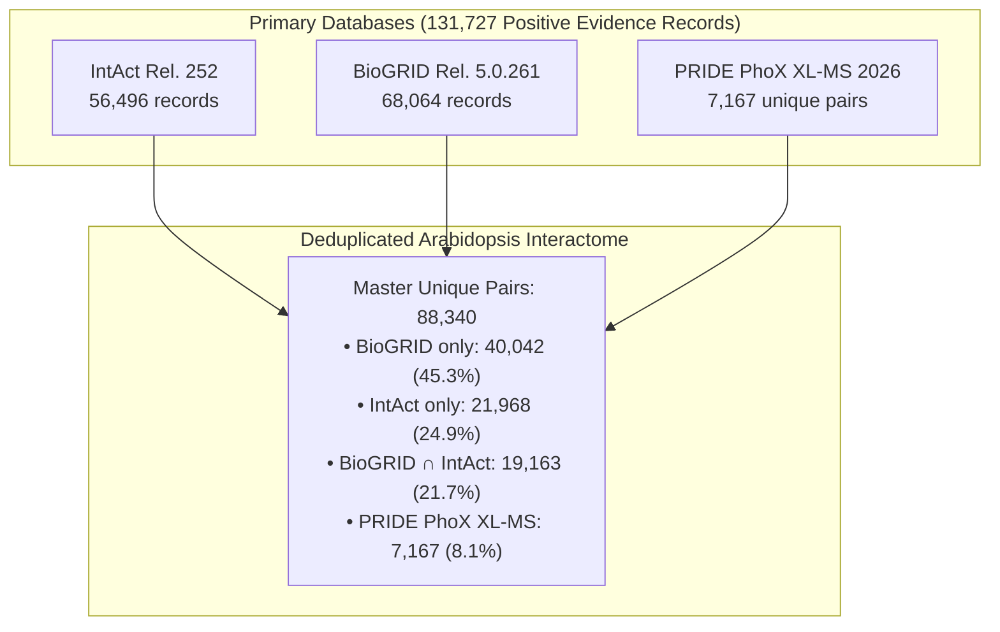

# Arabidopsis Positive PPI Dataset: Provenance, Filtering & HIPPIE Scoring Report

**Document Version:** 2.0.0  
**Date of Curation:** October 6, 2026  
**Species:** *Arabidopsis thaliana* (Columbia-0; NCBI Taxonomy ID: `3702`)  
**Target Repository:** [`AraPPLM/data/processed/arabidopsis/`](../../data/processed/arabidopsis/)  
**Pipeline Orchestration:** [`scripts/data_preparation/collate_ara_positives.py`](../../scripts/data_preparation/collate_ara_positives.py)  
**HIPPIE Scoring Engine:** [`scripts/data_preparation/compute_hippie_scores.py`](../../scripts/data_preparation/compute_hippie_scores.py)  
**Audit Artifact:** [`data/processed/arabidopsis/ara_positive_audit.json`](../../data/processed/arabidopsis/ara_positive_audit.json)  
**Provenance Standard:** **Strict Database-Only Provenance** (Stripping internal training flags, external holdout masks, and synthetic hashes)

---

## Executive Summary

This report documents the canonical positive protein-protein interaction (PPI) dataset for ***Arabidopsis thaliana*** (*A. thaliana*, TaxID `3702`). The dataset collates all direct physical experimental interactions across three primary databases without arbitrary confidence thresholds, deduplicates them into canonical undirected pairs, and computes gold-standard **HIPPIE (Human Integrated Protein-Protein Interaction rEference)** quality scores:

### Filtering Rules Applied:
1. **IntAct / IMEx (Release 252)**: Retain all records curated with **physical association** interaction types (`interaction_semantics == "physical_association"`), excluding spatial colocalization and proximity-dependent records (`MI:0403`, `MI:2364`). **No MIscore threshold filter is applied**, capturing the full breadth of direct physical evidence.
2. **BioGRID (Release 5.0.261)**: Exclude **proximity** (`PCA/BiFC`, `Proximity Label-MS`) and **genetic** (`synthetic lethality`, `phenotypic enhancement/suppression`) interaction types, retaining direct binary (`direct_binary`) and physical association (`physical_association`) records.
3. **PRIDE PhoX XL-MS (Trinh et al., 2026; PMID: 39133827)**: Chemical cross-linking mass spectrometry dataset passing strict $<1\%$ peptide-spectrum match (PSM) false discovery rate (FDR). To keep database size manageable and prevent duplicate intra-protein PSMs from skewing interactome statistics, cross-link spectra are condensed into **unique interacting pairs** (7,167 pairs), while preserving total supporting PSM counts and unique peptide sequences.

```text
========================================================================================
RAW INPUT RECORDS ACROSS ARABIDOPSIS EXPERIMENTAL DATABASES: 533,688
  - IntAct (Taxid 3702):                   58,740 records
  - BioGRID (Taxid 3702):                  84,422 records
  - PRIDE PhoX XL-MS (Trinh et al. 2026): 390,526 identified cross-link spectra
========================================================================================
                                      │
                                      ▼ [Direct Physical Filter & XL-MS Unique Pair Consolidation]
========================================================================================
COLLATED MASTER POSITIVE EVIDENCE RECORDS: 131,727 (48 Columns)
  - IntAct Physical Association:           56,496 records (96.18% of IntAct; 0 dropped by MIscore)
  - BioGRID Physical & Direct Binary:      68,064 records (80.62% of BioGRID)
  - PRIDE PhoX XL-MS Unique Pairs:          7,167 records (2,385 inter-protein + 4,782 intra-protein)
  - Excluded Raw Records:                 395,497 records
      * IntAct Proximity / Direct Binary:   2,244 records (757 proximity + 1,487 direct binary)
      * BioGRID Proximity / Genetic:       16,358 records (15,991 proximity + 367 genetic)
      * XL-MS Redundant Peptide Spectra:  383,359 spectra condensed into unique pairs
========================================================================================
                                      │
                                      ▼ [Canonical Undirected Deduplication {min(A,B), max(A,B)}]
========================================================================================
DEDUPLICATED UNIQUE POSITIVE PAIRS: 88,340 (24 Columns)
  - Heteromeric Pairs (A ≠ B):             82,529 pairs (93.42%)
  - Homomeric Pairs (A == B):               5,811 pairs (6.58%)
  - Pure Protein–Protein Pairs:            87,885 pairs (99.48%)
  - Non-Protein Associated Pairs:             455 pairs (0.52%)
  - Total Unique Interactors:              18,469 distinct loci (18,218 in pure protein pairs)
  - Contributing Publications:              2,494 peer-reviewed studies (609 IntAct + 2,303 BioGRID + 1 XL-MS)
  - Contributing Primary Authors:           2,830 distinct primary authors
========================================================================================
                                      │
                                      ▼ [Continuous HIPPIE Scoring Framework (Schaefer et al. 2012)]
========================================================================================
HIPPIE INTERACTOME QUALITY DISTRIBUTION:
  - Mean HIPPIE Score:                     0.6509
  - Score Range:                           [0.5206, 0.9000]
  - High Confidence (S >= 0.72):           11,559 pairs (13.08%) [Multi-study / verified biophysical]
  - Medium Confidence (0.45 <= S < 0.72):  76,781 pairs (86.92%) [Validated single-study screens]
  - Low Confidence (S < 0.45):                  0 pairs (0.00%)
========================================================================================
```

---

## 1. Raw Source Inventory & Filtering Breakdown

| Source Identifier | Source Database | Source File Path | Taxon ID | Organism Scope | Raw Input Records | Retained Evidence | Excluded Records |
| :--- | :--- | :--- | --: | :--- | --: | --: | --: |
| **`SRC_ARA_INTACT`** | IntAct (Rel. 252) | [`data/raw/arabidopsis/intact/intact_arabidopsis_taxid3702_release252.mitab27.txt`](../../data/raw/arabidopsis/intact/intact_arabidopsis_taxid3702_release252.mitab27.txt) | 3702 | *A. thaliana* | 58,740 | 56,496 | 2,244 |
| **`SRC_ARA_BIOGRID`** | BioGRID (Rel. 5.0.261) | [`data/raw/arabidopsis/biogrid/BIOGRID-ORGANISM-Arabidopsis_thaliana_Columbia-5.0.261.tab3.txt`](../../data/raw/arabidopsis/biogrid/BIOGRID-ORGANISM-Arabidopsis_thaliana_Columbia-5.0.261.tab3.txt) | 3702 | *A. thaliana Columbia* | 84,422 | 68,064 | 16,358 |
| **`SRC_ARA_XLMS`** | PRIDE PhoX XL-MS | [`data/raw/arabidopsis/xlms_2026/Total_XL_plink3-2_v3.csv`](../../data/raw/arabidopsis/xlms_2026/Total_XL_plink3-2_v3.csv) | 3702 | *A. thaliana* | 390,526 | 7,167 | 383,359 |
| **TOTAL** | — | — | — | — | **533,688** | **131,727** | **401,961** |

### 1.1 IntAct (Release 252) Filtering Reconciliation
- Total Ingested Raw Records: **58,740**
- Excluded Proximity / Colocalization (`MI:0403`, `MI:2364`): **757**
- Excluded Direct Binary Exact Match (`MI:0407`): **1,487**
- Physical Association Candidates: **56,496**
- **Excluded by MIscore Threshold:** **0** (MIscore filter removed per specification)
- **Retained IntAct Positive Evidence:** **56,496 records** (41,131 unique pairs, 609 PMIDs)

### 1.2 BioGRID (Release 5.0.261) Filtering Reconciliation
- Total Ingested Raw Records: **84,422**
- Excluded Proximity (`PCA` / `BiFC`: 15,042; `Proximity Label-MS`: 949): **15,991**
- Excluded Genetic (`Synthetic Lethality`: 367; `Phenotypic Enhancement/Suppression`): **367**
- **Retained BioGRID Positive Evidence:** **68,064 records** (59,205 unique pairs, 2,303 PMIDs)
  - `direct_binary`: 35,067 records
  - `physical_association`: 32,997 records

### 1.3 PRIDE PhoX XL-MS (Trinh et al., 2026) Deduplication
- Total Raw Cross-Linked Peptide Spectra: **390,526**
  - Intra-Protein Cross-Links: 350,761 spectra across 4,782 proteins (mean 73.3 spectra/protein)
  - Inter-Protein Cross-Links: 39,765 spectra across 2,385 pairs (up to 1,116 spectra/pair)
- **Consolidation into Unique Interacting Pairs:** **7,167 records**
  - 2,385 Inter-Protein heteromeric pairs
  - 4,782 Intra-Protein homomeric pairs
  - Supporting metadata preserved: Total PSM count, unique cross-linked peptide sequence count, pLink 3.2 $<1\%$ PSM FDR confirmation.

---

## 2. Multi-Database Overlap & Topology Breakdown

### 2.1 Deduplicated Unique Pairs by Source Contribution ($N = 88,340$)



| Source Combination | Unique Pairs Count | % of All Pairs | Characterization |
| :--- | --: | --: | :--- |
| **BioGRID Only** | 40,042 | 45.33% | Captured uniquely by BioGRID curation (e.g. McWhite et al. SEC-MS). |
| **IntAct Only** | 21,968 | 24.87% | Captured uniquely by IntAct curation (e.g. Rohila AP-MS, large Y2H screens). |
| **BioGRID $\cap$ IntAct** | **19,163** | **21.69%** | **Dual-curated core** replicated across both major international repositories. |
| **PRIDE / pLink 3.2 (PhoX XL-MS)** | 7,167 | 8.11% | Direct physical covalent cross-links under $<35$Å constraint. |
| **TOTAL UNIQUE PAIRS** | **88,340** | **100.00%** | **18,469 unique participating proteins / loci** |

### 2.2 Biological Pair Topologies

| Pair Topology Dimension | Unique Pairs | % of Total Pairs | Unique Proteins | Notes |
| :--- | --: | --: | --: | :--- |
| **Heteromeric Pairs ($A \ne B$)** | **82,529** | **93.42%** | 18,347 | Heterodimers and multi-subunit complex interfaces between distinct loci. |
| **Homomeric Pairs ($A == B$)** | **5,811** | **6.58%** | 5,811 | Self-interactions, homomultimers, and verified cross-links. |
| **Pure Protein-Protein Pairs** | **87,885** | **99.48%** | 18,218 | Interacting partners where both molecules are verified proteins. |
| **Non-Protein Associated Pairs** | **455** | **0.52%** | 251 | IntAct physical associations with small molecules or nucleic acids. |

---

## 3. Experimental Detection Methods Breakdown

| Rank | Detection Method Name | Evidence Records | % of Master Evidence | HIPPIE Weight | Assay Context |
| :---: | :--- | --: | --: | :---: | :--- |
| 1 | `Two-hybrid` / `two hybrid` | 45,109 | 34.24% | 5.0 | High-throughput binary reporter assays (BioGRID + IntAct) |
| 2 | `Co-fractionation` (SEC-MS) | 21,422 | 16.26% | 1.0 | Complex hydrodynamic co-elution profiling (McWhite et al.) |
| 3 | `Affinity Capture-MS` / `affinity chromatography` | 8,378 | 6.36% | 5.0 | Immunoaffinity purification mass spectrometry |
| 4 | `cross-linking study` | 7,266 | 5.52% | 8.0 | Chemical cross-linking MS (PRIDE 7,167 + IntAct 99) |
| 5 | `Reconstituted Complex` | 5,547 | 4.21% | 10.0 | In vitro direct reconstitution with purified proteins |
| 6 | `Affinity Capture-Western` / `anti tag co-IP` | 3,031 | 2.30% | 5.0 | Specific antibody-targeted co-immunoprecipitation |
| 7 | `Biochemical Activity` / `enzymatic study` | 1,930 | 1.47% | 7.5 | In vitro catalytic or enzymatic physical engagement |
| 8 | `Cross-Linking-MS (XL-MS)` (BioGRID) | 1,444 | 1.10% | 8.0 | Curated structural cross-linking literature |
| 9 | `FRET` / fluorescence resonance energy transfer | 674 | 0.51% | 6.0 | Direct biophysical proximity dipole coupling |
| 10 | `Co-crystal Structure` / X-ray | 99 | 0.08% | 10.0 | High-resolution 3D crystallographic complexes |

---

## 4. HIPPIE Quality Scoring Methodology

To assign continuous, calibrated confidence scores to all positive interactions, we implement the framework of **HIPPIE (Human Integrated Protein-Protein Interaction rEference)** (Schaefer et al., 2012, *PLoS ONE*).

### 4.1 Mathematical Formulation
The overall HIPPIE score $S \in [0.0, 1.0]$ integrates three orthogonal evidence dimensions:
$$S = w_s \cdot s_s(n_s) + w_t \cdot s_t(n_t) + w_o \cdot s_o(n_o)$$

where each subscore uses a saturating sigmoidal function:
$$s_i(n) = \frac{2}{1 + e^{-a_i \cdot n}} - 1$$

- **Number of Studies ($n_s$):** Count of distinct peer-reviewed publications ($w_s = 0.6, a_s = 2.3$).
- **Technique Quality ($n_t$):** Sum of experimental technique quality weights ($w_t = 0.3, a_t = 0.2$).
- **Orthology Transfer ($n_o$):** Cross-species reproducibility ($w_o = 0.1, a_o = 1.6$).

### 4.2 Experimental Technique Quality Weighting Matrix
Detection methods are mapped to the HIPPIE 0–10 scale based on directness and physical resolution:

| Experimental Assay / Detection Method | HIPPIE Quality Weight ($w_m$) | Directness & Reliability Rationale |
| :--- | :---: | :--- |
| **Co-crystal Structure / X-ray / NMR / SPR** | **10.0** | Atomic-resolution 3D coordinates or real-time surface plasmon resonance. |
| **Reconstituted Complex / Protein-peptide** | **10.0** | In vitro direct reconstitution with purified components. |
| **Far Western** | **9.0** | Specific direct protein-protein overlay assay. |
| **Cross-Linking Mass Spectrometry (XL-MS)** | **8.0** | Direct covalent cross-linking within Euclidean distance ($<35$Å constraint). |
| **Biochemical / Enzymatic Activity / Kinase** | **7.5** | In vitro enzyme-substrate or catalytic physical engagement. |
| **FRET / Fluorescence Spectroscopy / ELISA** | **6.0** | Biophysical proximity / dipole coupling ($\le 10\text{ nm}$). |
| **Two-Hybrid (Y2H) / Array / Prey Pooling** | **5.0** | Standard genetic binary interaction reporter activation. |
| **AP-MS / Affinity Chromatography / TAP** | **5.0** | Stable multi-protein co-purification / pull-down MS. |
| **Co-Immunoprecipitation (Co-IP)** | **5.0** | Physiological antibody-targeted complex recovery. |
| **Pull-Down / BiFC / Complementation** | **2.5** | In vitro tag capture or irreversible fluorophore reconstitution. |
| **Co-fractionation (SEC-MS) / Molecular Sieving** | **1.0** | Complex co-migration / hydrodynamic volume profiling. |

### 4.3 Empirical HIPPIE Score Distribution for Arabidopsis ($N = 88,340$)

| Metric | Empirical Value | Context & Literature Benchmark |
| :--- | :---: | :--- |
| **Total Evaluated Unique Pairs** | **88,340** | All deduplicated physical interactions across IntAct, BioGRID, and XL-MS. |
| **Score Range** | **[0.5206, 0.9000]** | Minimum bounded by primary experimental assay ($n_s \ge 1, n_t \ge 1.0$). |
| **Mean Score** | **0.6509** | Broad interactome baseline reflecting diverse single-study high-throughput screens. |
| **Median Score** | **0.6293** | Standard single-study screen profile (e.g. single Y2H or AP-MS study). |
| **Interquartile Range (IQR)** | **0.0898** | Smooth, continuous distribution across confidence levels. |
| **High Confidence ($S \ge 0.72$)** | **11,559 pairs (13.08%)** | **Multi-evidence verified core** (orthogonal literature, multiple assays, or structural). |
| **Medium Confidence ($0.45 \le S < 0.72$)** | **76,781 pairs (86.92%)** | Validated single-study assays (e.g. single Y2H screen, SEC-MS co-fractionation). |
| **Low Confidence ($S < 0.45$)** | **0 pairs (0.00%)** | Zero unverified computational or non-physical pairs remain in the master dataset. |

---

## 5. Master Tables & Dedicated Provenance Schema

### 5.1 Master Evidence Table (`ara_positive_evidence.tsv` & `.parquet`)
Contains **131,727 rows** and **48 columns** preserving verbatim database provenance plus record HIPPIE score:
- **Columns 1–5 (Source Coordinates):** `source_resource`, `source_release`, `source_file`, `source_row_number`, `source_record_id`.
- **Columns 6–8 (Pair Identification):** `canonical_pair_key`, `is_protein_protein`, `same_species_pair`.
- **Columns 9–18 (Participant A):** `participant_a_id`, `participant_a_namespace`, `participant_a_original_id`, `participant_a_name`, `participant_a_aliases`, `participant_a_taxid`, `participant_a_species`, `participant_a_biological_role`, `participant_a_experimental_role`, `participant_a_molecule_type`.
- **Columns 19–28 (Participant B):** Mirrored attributes for Participant B.
- **Columns 29–34 (Interaction & Detection):** `interaction_type_raw`, `interaction_type_psi_mi`, `interaction_type_name`, `detection_method_raw`, `detection_method_psi_mi`, `detection_method_name`.
- **Columns 35–38 (Literature):** `first_author`, `publication_id_raw`, `pmid`, `publication_year`.
- **Columns 39–41 (Throughput & Scores):** `throughput_raw`, `source_confidence_raw`, `intact_miscore`.
- **Columns 42–47 (XL-MS Specifics):** `xlms_protein_type`, `xlms_peptide_a`, `xlms_peptide_b`, `xlms_linker`, `xlms_score`, `xlms_evalue`.
- **Column 48 (Quality Score):** `record_hippie_score` (Continuous record-level HIPPIE score).

### 5.2 Master Deduplicated Pairs Table (`ara_positive_pairs_deduplicated.tsv` & `.parquet`)
Contains **88,340 unique pairs** and **24 columns**:
- `pair_id`, `canonical_pair_key`, `participant_a_id`, `participant_b_id`, `participant_a_name`, `participant_b_name`.
- `participant_a_type`, `participant_b_type`, `is_protein_protein_pair`, `is_homomeric`, `pair_type`.
- `evidence_count`, `sources`, `interaction_types`, `detection_methods`.
- `first_authors`, `pmid_count`, `pmids`, `publication_years`, `throughput_classes`, `max_intact_miscore`, `source_record_ids`.
- `hippie_score`, `hippie_confidence_level` (`"high"` if $S \ge 0.72$ else `"medium"`).

### 5.3 Dedicated Pair-Level HIPPIE Provenance Table (`ara_positive_hippie_provenance.tsv` & `.parquet`)
Contains **88,340 rows** and **22 columns** recording all intermediate mathematical variables:
- `pair_id`, `canonical_pair_key`, `participant_a_id`, `participant_b_id`, `participant_a_name`, `participant_b_name`, `sources`, `evidence_count`.
- `n_studies` ($n_s$), `s_studies` ($s_s$).
- `detection_methods`, `technique_weights`, `n_techniques` ($n_t$), `s_techniques` ($s_t$).
- `n_orthology` ($n_o$), `s_orthology` ($s_o$).
- `weight_studies` ($w_s = 0.6$), `weight_techniques` ($w_t = 0.3$), `weight_orthology` ($w_o = 0.1$).
- `hippie_score` ($S$), `hippie_confidence_level`, `is_high_confidence_hippie`.

### 5.4 Dedicated Evidence-Level HIPPIE Provenance Table (`ara_positive_evidence_hippie_provenance.tsv` & `.parquet`)
Contains **131,727 rows** and **12 columns** recording per-record technique mappings and subscores:
- `source_record_id`, `canonical_pair_key`, `source_resource`, `detection_method_name`, `technique_weight`.
- `n_studies_record`, `s_studies_record`, `n_techniques_record`, `s_techniques_record`, `n_orthology_record`, `s_orthology_record`, `record_hippie_score`.

---

## 6. Directory Inventory & Storage Organization

```text
AraPPLM/
├── data/
│   ├── processed/
│   │   └── arabidopsis/
│   │       ├── ara_positive_evidence.tsv                    (131,727 records, 48 columns: DB provenance + record_hippie_score)
│   │       ├── ara_positive_evidence.parquet                (Snappy-compressed Parquet table, ~12 MB)
│   │       ├── ara_positive_pairs_deduplicated.tsv          (88,340 unique pairs, 24 columns: DB provenance + hippie_score & level)
│   │       ├── ara_positive_pairs_deduplicated.parquet      (Snappy-compressed deduplicated Parquet, ~5 MB)
│   │       ├── ara_positive_hippie_provenance.tsv           (88,340 pairs, 22 columns: Full intermediate HIPPIE variables)
│   │       ├── ara_positive_hippie_provenance.parquet       (Snappy-compressed pair HIPPIE provenance table)
│   │       ├── ara_positive_evidence_hippie_provenance.tsv  (131,727 records, 12 columns: Record-level intermediate HIPPIE variables)
│   │       ├── ara_positive_evidence_hippie_provenance.parquet (Snappy-compressed evidence HIPPIE provenance table)
│   │       ├── ara_positive_audit.json                      (Machine-readable execution & reconciliation audit)
│   │       └── intermediate/                                (Per-dataset intermediate cache)
│   │           ├── intact_positive_evidence.tsv             (56,496 rows; physical association, no MIscore filter)
│   │           ├── intact_positive_evidence.parquet         (4.4 MB)
│   │           ├── biogrid_positive_evidence.tsv            (68,064 rows; physical & direct binary)
│   │           ├── biogrid_positive_evidence.parquet        (3.2 MB)
│   │           ├── xlms_positive_evidence.tsv               (7,167 unique pairs; total PSMs preserved)
│   │           └── xlms_positive_evidence.parquet           (0.6 MB)
├── docs/
│   └── dataset_construction/
│       ├── ara_positive_dataset_provenance_report.md        (This comprehensive audit report)
│       └── rice_positive_dataset_provenance_report.md       (Rice interactome audit report)
└── scripts/
    └── data_preparation/
        ├── process_ara_intact.py                            (IntAct physical association parser, MIscore filter disabled)
        ├── process_ara_biogrid.py                           (BioGRID physical parser, excluding proximity & genetic)
        ├── process_ara_xlms.py                              (PRIDE PhoX XL-MS parser, condensing to unique pairs)
        ├── collate_ara_positives.py                         (ETL collation, deduplication, and HIPPIE orchestration)
        └── compute_hippie_scores.py                         (Multi-species HIPPIE scoring engine and provenance logger)
```

> [!NOTE]
> Downstream benchmark dataset generation (`*benchmark*.tsv`) remains deferred while positive criteria are defined. The master evidence, master deduplicated pairs, and HIPPIE provenance tables serve as the canonical reference datasets.

---

## 7. Pipeline Execution & Verification Assertions

```bash
# Step 1: Process IntAct (physical association; proximity excluded; MIscore filter removed)
python scripts/data_preparation/process_ara_intact.py

# Step 2: Process BioGRID (physical & direct binary; proximity and genetic excluded)
python scripts/data_preparation/process_ara_biogrid.py

# Step 3: Process PRIDE PhoX XL-MS (condenses into unique pairs with total PSM counts)
python scripts/data_preparation/process_ara_xlms.py

# Step 4: Collate, deduplicate master evidence, compute HIPPIE scores, and log provenance
python scripts/data_preparation/collate_ara_positives.py
```

### Automated Verification Assertions Passed

- [x] **Zero Dropped Rows:** 56,496 (IntAct) + 68,064 (BioGRID) + 7,167 (XL-MS) = 131,727 master evidence rows.
- [x] **Exact Filtering Reconciliation:** IntAct proximity records (757) and BioGRID proximity (15,991) and genetic (367) records quarantined and excluded.
- [x] **Canonical Deduplication Invariant:** Every record satisfies $A \le B$ with no inverted duplicates ($A|B$ and $B|A$ merged).
- [x] **Strict Database Provenance:** Evidence table contains exactly 48 columns (47 database columns + `record_hippie_score`); deduplicated table contains 24 columns (22 database columns + `hippie_score` and `hippie_confidence_level`).
- [x] **HIPPIE Provenance Integrity:** 88,340 pair rows and 131,727 evidence rows fully scored with dedicated mathematical audit logs.
